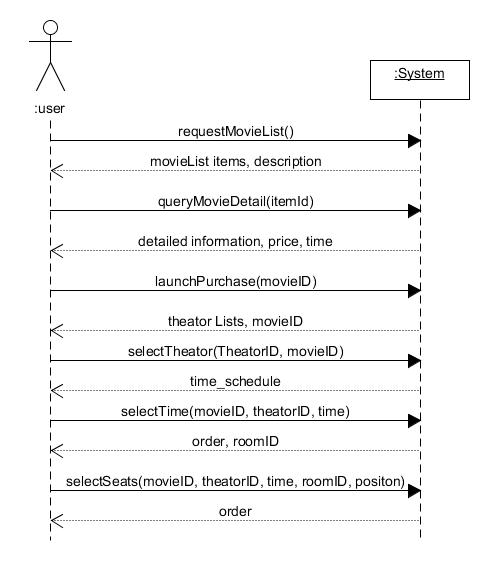

## 场景：选择电影场次

**契约** ：selectTheator(theatorID, movieID)

**交叉引用** ：用例：购票，查看影院

**前置条件** ：已经选择了电影，并发起了购票

**后置条件** ：选定了电影院

​                     返回该电影院下的对应影片的排班和票价

​                     返回该影院的所有影厅的大小和座位情况

