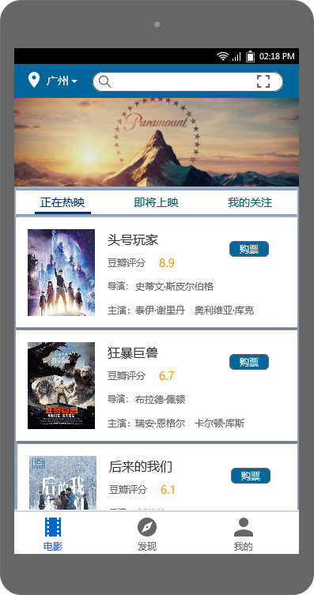
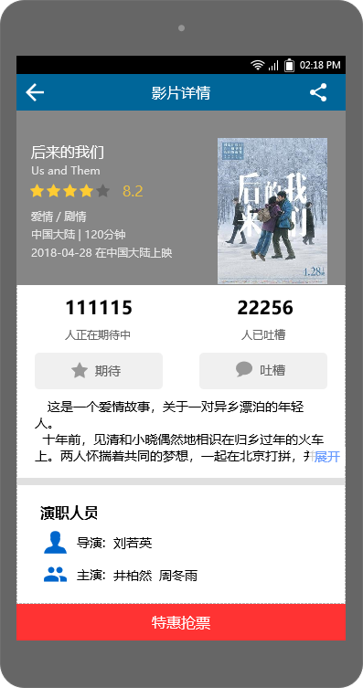
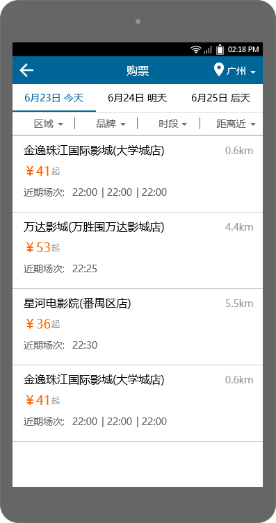
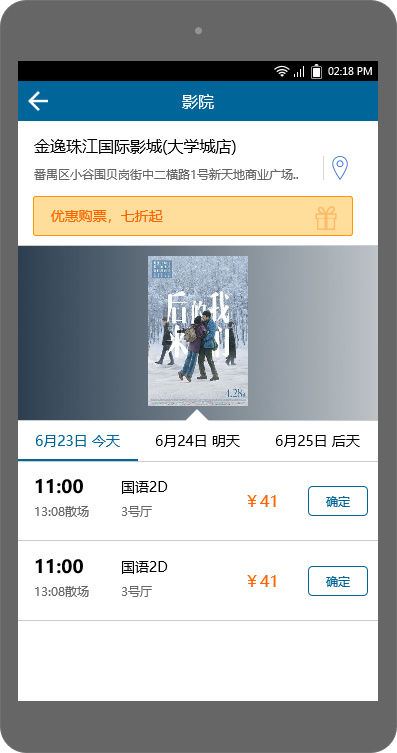
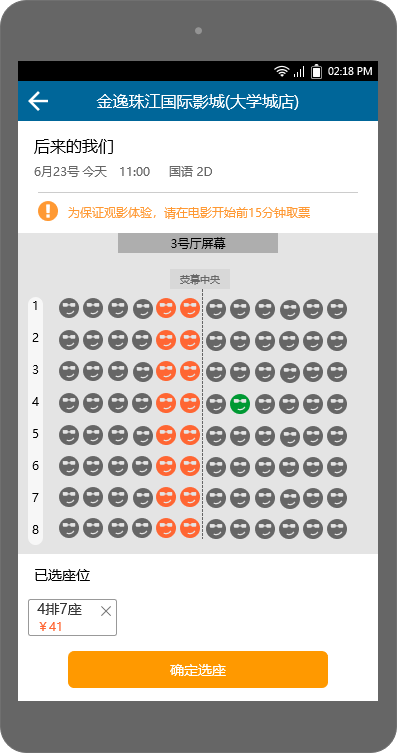

# 购票用例UI设计

首先登录app后进入电影列表界面：

直接点击电影列表的某一项，进入电影的详情界面：

然后点击下方的特惠抢票或者直接点击电影列表上的购票，进入一个影院列表页面：

该影院列表显示的是所有在指定日期有该片上映的影院，用户可通过时间，距离等维度对影院进行筛选，选择影院后，随机进入该影院的排片详情界面：

选择一个排片时间段，点击确定后，进入选座页面：

途中，橙红色内容代表已经被选走的座位，灰黑色表示还未选的座位，选定一个座位后，会用绿色标记提醒用户，最后点击确定选座完成购票。