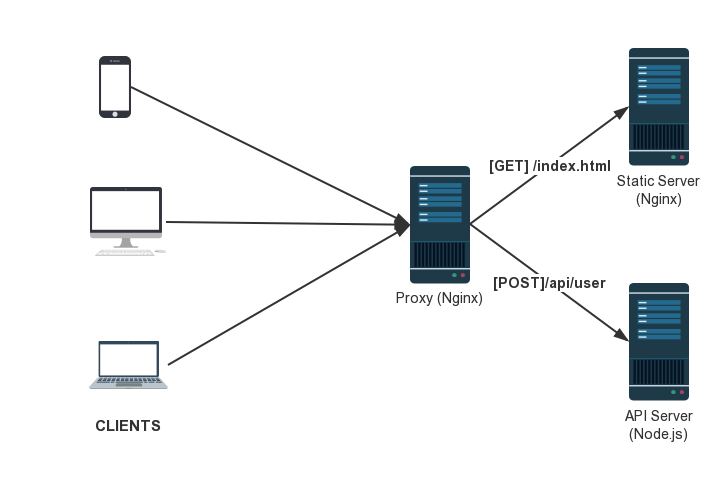

# 软件设计文档

## 一、后端技术分析

### 概述

E-Tickets 服务端的静态服务器使用 Nginx，API 服务器使用 Node.js，koa2 框架编写，反向代理使用 Nginx，如下为图示：



数据库使用 MySQL。


### 技术选型理由

#### Nginx

选择 Nginx 的理由很简单，基于 epoll 实现的 I/O 多路复用技术能够使得 Nginx 轻松 handle 高并发连接，且稳定性高，内存占用少。

---

#### Node.js

众所周知，web 服务属于 I/O 密集型，CPU 在绝大部分时间处于空闲状态而等待 I/O，

Node.js 有两大特性：事件驱动，异步 I/O，这使得 Node.js 天生适合 I/O 密集型任务，处理高并发问题。

---

#### Koa2

Koa2 是一个轻量级 web 框架，使用了最新 ES7 的 async 和 await 语法糖，这样能够将异步编程同步化，避免了 callback 地狱，使得开发体验更好。

---


### 架构设计

服务端使用三层架构：

* 数据持久化层：对应 models 目录，负责进行数据库层面的增删改查功能，不做任何逻辑。
* 业务逻辑层：对应 services 目录，负责所有的业务逻辑。
* 表示层：对应 controllers 目录，负责传递客户端和服务端交换的数据，并做权限判断。


---

### 模块划分

模块分为以下：

* 用户模块：包含用户、管理员、影院运营者所需功能。
* 电影模块：包含电影相关信息和所需功能。
* 排片模块：包含排片信息和所需功能。
* 订单模块：负责处理用户交易功能。
* 评论模块：负责用户评论的相关功能。

---

## 二、前端技术分析

主要使用技术
javascript( ES6规范 ), Vue框架（Vue-cli 使用 webpack 模板）, css, html

### 文件目录结构

采用了`Vue-cli`的`webpack`模式的模板
即全面的webpack+vue-loader的模板，功能包括热加载（更新），linting（语法检测），测试和Css扩展

``` lang = file
web-user-interface
 ├── build                      # 用来存放webpack相关配置文件
 │   │── build.js                   # 生产环境结构代码
 │   │── webpack.base.conf.js       # webpack基础配置
 │   │── webpack.dev.conf.js        # webpack开发环境配置
 │   │── webpack.prod.conf.js       # webpack生产环境配置
 │   │── check-versions.js          # 检查npm,node等版本相关
 │   │── utils.js                   # 构建工具
 │   └── vue-loader.conf.js         # vue-loader配置
 │── config                     # 用来存放关于项目生产开发环境的配置文件
 │   │── index.js                   # 项目基本配置文件
 │   │── dev.env.js                 # 开发环境配置文件
 │   └── prod.env.js                # 生成环境配置文件
 │── dist                       # 最终打包生成的目标文件夹
 │   └── XXX                        # 项目最终生产结果文件
 │── src                        # 项目源代码目录
 │   │── assets                     # 资源文件夹
 │   │── components                 # 组件存放目录
 │   │── router                     # 路由配置目录
 │   │── App.vue                    # 项目默认组件,入口文件
 │   └── main.js                    # 程序入口文件,引用加载其他组件
 │── test                       # 用来存放测试相关代码
 │── static                     # 静态文件目录
 │── package.json               # 项目相关基本信息
 │── .babelrc                   # ES6语法编译配置
 │── .editorconfig              # 代码格式配置
 │── .postcssrc.js              # postcss相关
 │── README                     # 项目说明文档
 └── index.html                 # 入口页面
```

### 前端路由

整个前端界面使用前端路由导航，单页面应用模式。
`import Router from 'vue-router'` 使用 `Vue Router`
然后只要将组件 `components` 映射到路由`routes`，然后告诉 `Vue Router` 在哪里渲染它们
通过注入路由器，我们可以在任何组件内通过 `this.$router` 访问路由器，也可以通过 `this.$route` 访问当前路由
```lang=js
import HomePage from '@/components/HomePage' 

Vue.use(Router)

export default new Router({
  routes: [
    {
      path: '/',
      name: 'Home',
      component: HomePage
    },
    // ...
    {
      path: '/moviepurchase/:id',
      name: 'Purchase',
      component: PurchasePage
    }
    // 以及使用带有参数的动态路由传递参数给相关组件，构建不同的页面内容
  ]
})

```

给每个路由配置对应的组件, 然后在之后的页面中，我们可以非常方便的使用路由来进行导航。
使用`this.$router`，并不需要在每个独立的组件中都导入路由。
```lang=js
        this.$http.get('api/user/self')
          .then((data) => {
            // successful
            console.log(data.body.data.username)
            this.$router.push({name: 'Purchase', params: {id: this.movieId}})
          }, () => {
            // fail
            this.$router.push({name: 'Sign'})
          })
```

还可以非常方便的访问历史进行回退
```lang=js
  goBack () {
    window.history.length > 1
      ? this.$router.go(-1)
      : this.$router.push('/')
  }
```

### vue相关

#### mvvm

使用了vue双向数据绑定的特性，脱离了DOM操作，直接关注于数据

使用v-for指令渲染一整个数组到我们的项目列表

```lang=html
<div id="carousel-items">
  <span
  v-for="(item,index) in slideList.length"
  v-bind:key="index"
  :class="{'active':index===currentIndex}"
  @mouseover="change(index)"></span>
</div>
```
#### 用户事件

使用v-on指令添加事件监听器
```lang=html
  <div v-for="theatre in filteredTheatres" v-bind:key="theatre.index" v-on:click="jumpToThertre(theatre.id)">
```
然后调取的是在组件实例中定义的方法
```lang=js
methods: {
  jumpToThertre (thertreId) {
    this.$router.push({name: 'TheatreDetail', params: {mid: this.$route.params.id, tid: thertreId}})
  }
}
```
而在事件处理方法中，我们只需要对数据的变化进行考虑，不许要去操作DOM，我们对数据的修改都会直接展示在页面上面响应的绑定位置上。

#### 计算属性

在对页面内数组数据渲染的筛选上，我多次使用了计算属性。
这样展示的就不是原始数组，而是根据条件进行筛选计算之后的得到的新数组，而且随着筛选条件的更改，相应的数据也会随之改变。

```lang=HTML
  <div v-for="theatre in filteredTheatres" v-bind:key="theatre.index" v-on:click="jumpToThertre(theatre.id)">
    <div>
      <p>{{theatre.name}}</p>
      <p>￥{{theatre.price}}起</p>
      <p>近期场次 :{{theatre.time}}</p>
    </div>
    <p>{{theatre.location}}km</p>
  </div>
```

```lang=js
  computed: {
    filteredTheatres: function () {
      return this.theatres.filter((theatre) => {
        console.log(this.targetDate)
        return theatre.date.match(this.targetDate)
      })
    }
  }
```
#### class与style

我们还是使用切换class的方式来进行style的改变
这里对于每个座位的选择情况使用了三个类，不可选，可选，已选来改变其颜色等样式

```lang=html
  v-bind:class="{occupy: seat.occupy, avaliable: !seat.occupy&&!seat.selected, selected: !seat.occupy&&seat.selected }"
```

对应的数据就是每个座位，几行几列，是否可选，是否已选等等

```lang=js
      this.seats.push({
        row: xxx,
        column: xxx,
        occupy: true,
        selected: false
      })
```

然后不同的cssclass内有不同的样式，我们只要在任何一处代码修改了数据中选择的状态，就可以切换相应座位的class

```lang=css
.occupy {
  background: url('../../static/img/researve_seats/face_not_avaliable.png');
}

.avaliable {
  background: url('../../static/img/researve_seats/face_avaliable.png');
}

.selected {
  background: url('../../static/img/researve_seats/face_selected.png');
}
```

#### 轮播图

使用了vue的css过渡，`transition-group`列表过渡，来同时渲染整个列表

并且定义了自动运行，停止，更改等方法来实现一个一个播放的功能
```
go () {
      this.timer = setInterval(() => {
        this.autoPlay()
      }, 4000)
    },
    stop () {
      clearInterval(this.timer)
      this.timer = null
    },
    change (index) {
      this.currentIndex = index
    },
    autoPlay () {
      this.currentIndex++
      if (this.currentIndex > this.slideList.length - 1) {
        this.currentIndex = 0
      }
    }
```

根据vue的规定自定义的过渡类名

```lang=js
.list-enter-to {
    transition: all 1s ease;
    transform: translateX(0);
  }
  .list-leave-active {
    transition: all 1s ease;
    transform: translateX(-100%)
  }
  .list-enter {
    transform: translateX(100%)
  }
  .list-leave {
    transform: translateX(0)
  }
```

### css

####媒体查询

使用媒体查询类根据屏幕大小去欸的那个根字体大小，然后使用rem进行响应式布局设计。

```lang=css
@media screen and (max-width: 450px){
  html {
    font-size: 8px;
  }
}
@media screen and (min-width: 539px){
  html {
    font-size: 12px;
  }
}
@media screen and (min-width: 719px){
  html {
    font-size: 16px;
  }
}
```

#### flex布局

使用flex布局，在主轴交叉轴上的控制变得极为方便。
```lang=css
// 使用flex布局
display:flex | inline-flex;
// 元素在主轴上面的排列方向
flex-direction: row | row-reverse | column | column-reverse;
// 元素在排列不下时换行的规则
flex-wrap: nowrap | wrap | wrap-reverse;
// 元素在主轴上对齐的方式
justify-content: flex-start | flex-end | center | space-between | space-around;
// 元素在交叉轴上面的对齐方式
align-items:  flex-start | flex-end | center | baseline | stretch;
// ...
```
在我们的界面设计中也使用了很多次来实现一些布局的设计
```lang=css
    display: flex;
    flex-direction: row;
    justify-content: space-around;
    align-items: center;
```