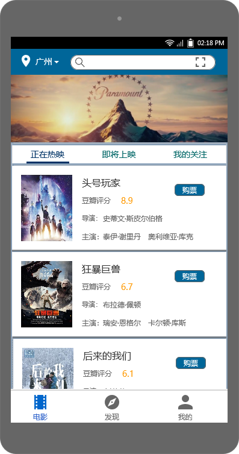
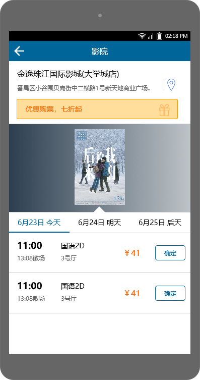
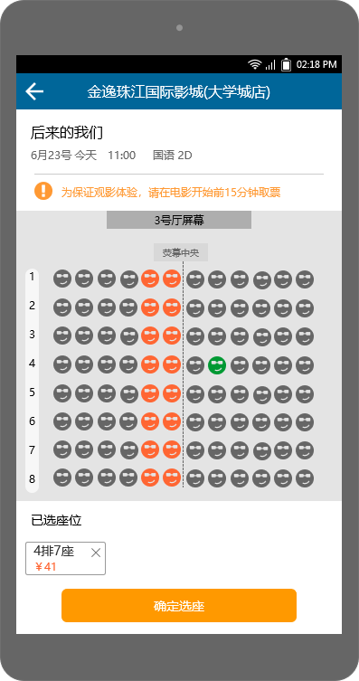

# 软件需求规格说明书

## 1. 产品的目标

### 1.1  项目背景

目前现有的购票平台大多功能单一，很大程度上只考虑了电影展示这部分的问题，却忽略观影群体在购票时所需要迫切解决的其他问题，如：

你是否有过想挑选一部激动人心的合家欢电影，却误入血腥暴力的动作电影的不快经历？

你是否有过观影过后，意犹未尽，想与所有人尽情剖析电影中微妙细节，但又无人可谈起的寂寞？

你是否有过在电影正片播完后，犹豫不决，不知该离开还是留下看看有没有彩蛋的忐忑？

你是否有过看完某部电影，被片中主人公的精湛演技或者导演的奇思妙想所触动，想要进一步了解他们更多作品的冲动？

如果你是有过上面几种情况中的一种或者多种的人，那么恭喜你，我们的产品将致力为你打造一份极致的体验！

### 1.2  产品的目标

针对当前线上购票平台出现的一系列问题，我们致力于打造一个轻松简便的一体化智能购票平台，在解决传统购票平台关于电影预购提醒、座位抉择建议、电影内容建议分级等方面有所欠缺的一些功能的同时，提供观影群众一个解读、交流电影内容的话题板块。

## 2. 产品的用户

### 2.1  产品的用户

1. 对购票存在疑问的观影群体
2. 追寻特别类型电影的小众群体
3. 渴望在观影前后与他人无障碍沟通的影视爱好者。
4. 影视、传媒工作室

### 2.2  对用户设的优先级

**关键用户**：对购票存在疑问的观影群体；渴望在观影前后与他人无障碍沟通的影视爱好者。

**次要用户**：追寻特别类型电影的小众群体

**不重要的用户**：影视，传媒工作室

## 3.需求限制条件

### 3.1 解决方案限制条件

1. 软件对于用户必须是易上手，学习成本低的，用户上手就能直接使用。
2. 界面跳转逻辑设置必须合理、简单，用户想要完成任何操作时，跨度不会超过三个界面。
3. 页面展示需要简洁，主次分明，让用户在第一眼就能看见核心内容。

### 3.2 实现环境

此购票平台主要以Web页面形式，在浏览器中呈现。

### 3.3 伙伴应用

豆瓣：获取电影评分，提供给用户作为影片质量的参考指标之一

支付宝、微信：提供第三方账号登录和支付接口。

### 3.4  预期的工作场地环境

台式机及各移动设备。

## 4.相关事实

- 本产品暂时处于内部测试阶段，部分数据可能与实际情况不符，仅作参考。

- 本产品的服务器暂时挂在个人机上，可能存在不稳定问题，并非产品设计本身的缺陷。

  ​

## 5.假定

产品的使用者主要有三种不同角色：

1. 用户：主要行为为购票，查看影片相关信息，评论。

2. 影院管理者：主要负责电影上架，影院排片，上传影院相关信息。

3. 管理者：负责电影信息的编辑，导入，用户评论审核，每日内容发布。

   ​

## 6. 产品的范围

### 6.1  工作的上下文范围

Context Diagram如下：

### 6.2 工作切分

系统要响应的所有业务事件清单如下：

| 功能模块 | 业务事件      | 输入             | 输出                 |
| ---- | --------- | -------------- | ------------------ |
| 用户登录 | 账密码号登录    | 用户名，密码         | 登录结果，用户状态          |
| 用户登录 | 第三方登录     | 第三方账号与授权       | 登录结果，用户状态          |
| 用户登录 | 账号注册      | 用户资料，密码        | 注册结果               |
| 查看影片 | 查看最近热门电影  | 时间             | 最近热映电影列表           |
| 查看影片 | 查看即将上映电影  | 时间             | 即将上映的电影列表          |
| 查看影片 | 查看某一电影的详情 | 电影名            | 电影相关信息，包括简介，评分，类型等 |
| 购票   | 点击购买      | 电影id，时间        | 正在上映该片的影院列表        |
| 购票   | 选择影院      | 影院id，时间        | 该影院的详细信息，影片在各放映厅排班 |
| 购票   | 位置选择      | 影院id, 时间，影厅，位置 | 生成订单信息，包括位置，时间，价格等 |

 

### 6.3  产品边界

用例图如下：

 

## 7.功能性需求与数据需求

### 7.1 功能性需求

基本需求如下：

| 功能模块 | 业务事件      | 输入             | 输出                 |
| ---- | --------- | -------------- | ------------------ |
| 用户登录 | 账密码号登录    | 用户名，密码         | 登录结果，用户状态          |
| 用户登录 | 第三方登录     | 第三方账号与授权       | 登录结果，用户状态          |
| 用户登录 | 账号注册      | 用户资料，密码        | 注册结果               |
| 查看影片 | 查看最近热门电影  | 时间             | 最近热映电影列表           |
| 查看影片 | 查看即将上映电影  | 时间             | 即将上映的电影列表          |
| 查看影片 | 查看某一电影的详情 | 电影名            | 电影相关信息，包括简介，评分，类型等 |
| 购票   | 点击购买      | 电影id，时间        | 正在上映该片的影院列表        |
| 购票   | 选择影院      | 影院id，时间        | 该影院的详细信息，影片在各放映厅排班 |
| 购票   | 位置选择      | 影院id, 时间，影厅，位置 | 生成订单信息，包括位置，时间，价格等 |

### 7.2 数据需求

领域模型如下：

对应数据库的E-R图如下：

## 8.观感需求

### 总体产品原型设计说明

本文档主要由于说明产品设计原型中各个布局参数的设置，便于前端开发者进行前端界面的布局。另外，在此提供项目原型的演示地址，可点击此[链接](https://run.mockplus.cn/mVrQBccUcAig6cZa/index.html) 前往查看（注：为达到最佳观看效果，请用最新版本chrome浏览器打开，且可右键打开检查，直接获得各个组件的大小参数）。

#### 1. 主界面

主界面整体以蓝色为基调，大小为*360*  * *640*，主要分为3个页面，分别为**电影界面**、**发现界面** 和**我的界面** ，下面对其来进行一一说明。

#### 电影界面

设计如下图：

​	可以看到，电影界面按照从上到下的顺序，又能分为四个主体部分：

##### a. 最上方的功能栏

​	首先其大小为360*45(宽和高)，最左边的位置图标大小为20 * 20，且距离左、上边缘的距离分别为15px和10px，接着广州这个地点字段高度为25，水平位置上紧挨位置图标，并在竖直位置上与位置图标保持在同一高度。广州字段后紧跟一个小小的向下箭头图标，该图标为8 * 8大小，在竖直方向上处于广州字段的中间位置。

​	然后，后面是一个搜索栏，大小为240 * 25，竖直位方向仍与前面的地点字段广州的位置保持对齐，且其在水平方向上距向下箭头20px，在搜索框左右方各有一个图片按钮，大小为16 * 16。

##### b. 图片轮播区域

​	

​	这个没什么多说的，它就位于前面功能栏的正下方，大小为360 * 112。

##### c. 列表区域

​	列表区域从上而下又可以分为两块，一块是标签栏，位于上方，起着导航的作用。下面为滚动区域，用于滚动显示列表内容。而且可以清晰的看出，列表之间有明显的线条，用于区分列表项和装饰。列表区域整体大小为360 *  405，背景底色rgb值为003366，且透明度为60%。

​	上方标签栏距离列表区域顶部5px，其大小为356 * 30，左右距离边界2px，其底色为纯白色，字体大小为14px，字体颜色在未选中时为006666，选中后变为003366，选中后字段下出现下划线，颜色与选中后字的颜色一致，且大小为60 * 3。

​	下方滚动区域，区域左右都与边界有2px的间隙，区域中中每个列表项的大小都为356*160，左边图片大小为85 * 110，距离上、左边界15px，右边文字区域在竖直方向上全部对齐，且与图片右边缘相距10px，文字框与文字框之间的数值间距为30px，最右方的按钮大小为50 * 20, 距离右、上边界85px和30px，底色为006699，文字颜色为纯白(FFFFFF)。

##### d. 底部导航栏

​	位于界面底部，大小为360 * 58，其顶部有一条高度为2的线条，颜色为999999，透明度为0.4, 主题内容为3个大小为24 * 24的图标，每个图标下有一个高度为2px，字体大小为12px的字段。

#### 2.发现界面

​	发现界面主要也分为4个部分，顶部功能区，中部功能区，资讯列表区和底部导航栏。在此不具体说明大小了，可前往[链接](https://run.mockplus.cn/mVrQBccUcAig6cZa/index.html), 在浏览器中打开后，右键点击检查查看。

#### 3.用户界面

如上图所示，同样，在此不具体说明大小了，可前往[链接](https://run.mockplus.cn/mVrQBccUcAig6cZa/index.html), 在浏览器中打开后，右键点击检查查看。

#### 4. 登录注册界面

登录：

注册：

#### 5.电影详情界面

#### 6. 点击购票后显示影院列表

#### 7. 影院拍片详情

#### 8. 选座购票

#### 9. 订单详情

## 9. 后续版本的需求

后续期待继续完成的需求有：

1. 添加动态评论区，区分未看过与看过影片的用户，使得他们可以畅所欲言，不受其他因素困扰。
2. 电影收藏与智能推荐：根据用户收藏的电影进行相关影片和资源的推荐。

