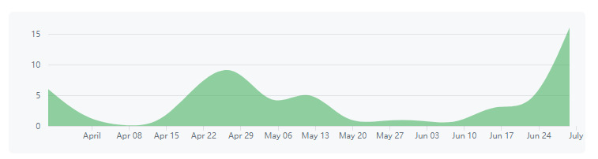
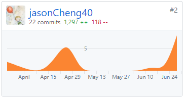

# Final Report

15331053 - jasonCheng40

## 一、自我总结

本次项目我主要是担任产品的角色，负责项目的需求设计，产品原型设计以及文档的维护。

前期，我主要确定了产品的主要特点以及功能点的设计，提出产品的基本需求和扩展功能，定下了我们开发的方向。然后在后续的过程中，我主要进行了产品原型的设计，页面流程的跳转逻辑的构建，还负责一些日常文档的维护。

## 二、PSP2.1 统计表

| PSP 2.1                                 |                      | Time (person hour) |
| :-------------------------------------- | :------------------- | :----------------- |
| **Planning**                            | **计划**               | **5**              |
| .Estimate                               | 估计任务时间               | 5                  |
| **Development**                         | **开发**               | **40**             |
| .Analysis                               | 需求分析 (包括学习新技术)       | 20                 |
| .Design Spec                            | 生成设计文档               | 20                 |
| .Design Review                          | 设计复审 (和同事审核设计文档)     | 5                  |
| .Coding Standard                        | 代码规范 (为目前的开发制定合适的规范) | 5                  |
| .Design                                 | 具体设计                 | 50                 |
| .Coding                                 | 具体编码                 | 0                  |
| .Code Review                            | 代码复审                 | 0                  |
| .Test                                   | 测试（自我测试，修改代码，提交修改）   | 0                  |
| **Report**                              | **报告**               | **15**             |
| .Test Report                            | 测试报告                 | 2                  |
| .Size Measurement                       | 计算工作量                | 3                  |
| .Postmortem & .Process Improvement Plan | 事后总结, 并提出过程改进计划      | 15                 |

---

## 三、个人 git 统计

- 最有价值的工作清单：

  - 产品需求设计

  - 产品原型设计，花费最多时间，成果不错的！

    原型设计图：点击[链接](../../doc/7_design/7_1_UI_design/产品原型设计说明.md)前往

- 个人博客url:

  - 原型设计：[链接](https://run.mockplus.cn/mVrQBccUcAig6cZa/index.html)
  - 博客搭建：[链接](https://jasoncheng40.github.io/web/2018/03/11/%E5%A6%82%E4%BD%95%E7%94%A8jekyll%E6%90%AD%E5%BB%BAGithub-Page(1).html)