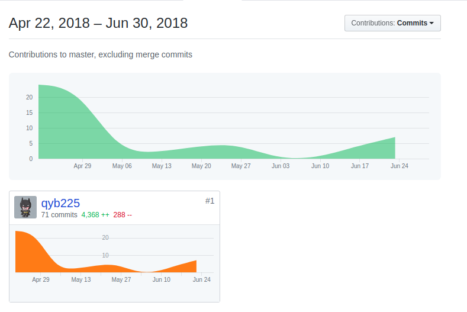
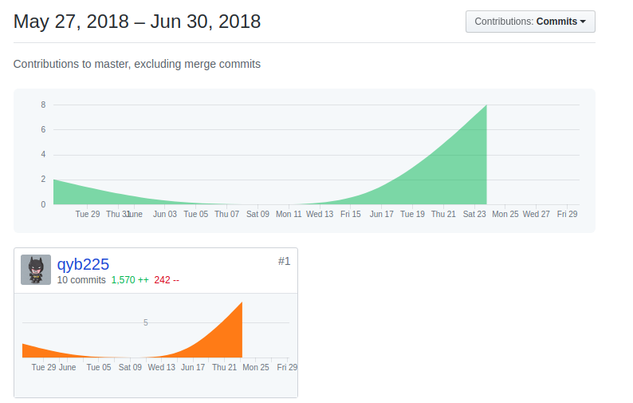
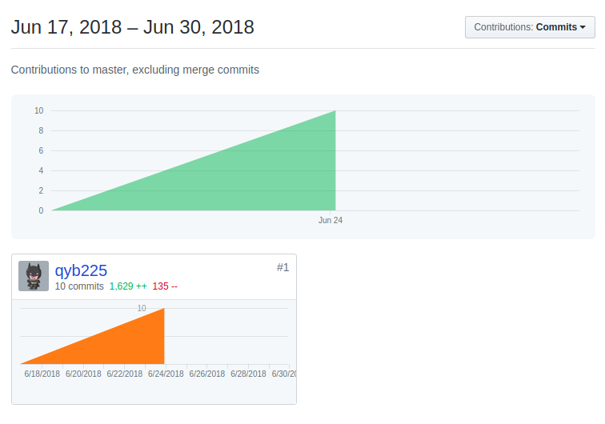
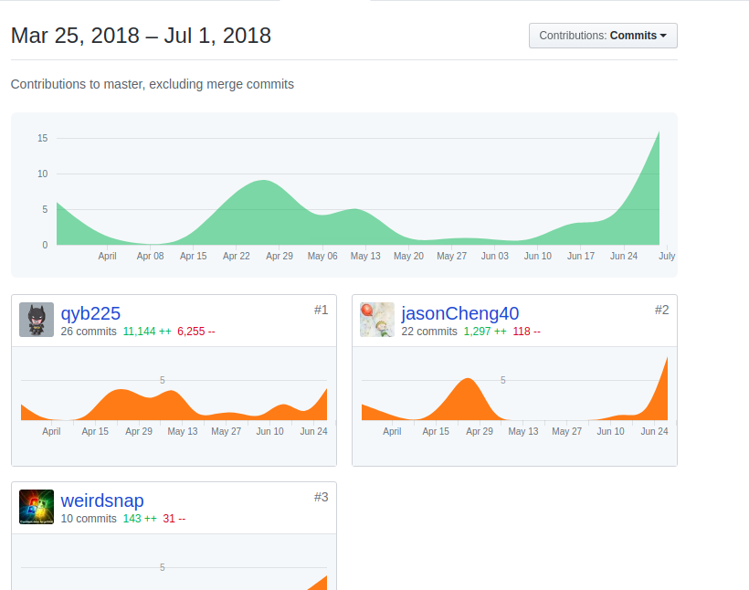

# Final Report

15331054 - Qubic(qyb225)

## 一、自我总结

本次我主要负责项目后台的搭建，整个后台使用 Nginx 作为反向代理，将不同的请求转发给静态 / API 服务器。API 服务使用 Node.js 的 koa2 框架编写，因为 ES7 引入了 async / await 的语法，使得异步编程变得更加容易。后台整体使用三层架构。

之后完成了影片管理系统和影院管理系统的前端开发，这两个系统相对于用户系统来说简单许多，这也能让前端同学专注开发用户系统。

---

## 二、PSP2.1 统计表

| PSP 2.1 | | Time (person hour) |
|:---|:---|:---|
| **Planning** | **计划** | **5** |
| .Estimate | 估计任务时间 | 5 |
| **Development** | **开发** | **80** |
| .Analysis | 需求分析 (包括学习新技术) | 15 |
| .Design Spec | 生成设计文档 | 5 |
| .Design Review | 设计复审 (和同事审核设计文档) | 5 |
| .Coding Standard | 代码规范 (为目前的开发制定合适的规范) | 5 |
| .Design | 具体设计 | 15 |
| .Coding | 具体编码 | 25 |
| .Code Review | 代码复审 | 5 |
| .Test | 测试（自我测试，修改代码，提交修改） | 5 |
| **Report** | **报告** | **15** |
| .Test Report | 测试报告 | 2 |
| .Size Measurement | 计算工作量 | 3 |
| .Postmortem & .Process Improvement Plan | 事后总结, 并提出过程改进计划 | 10 |

---

## 三、个人 git 统计

Github 账号为 **qyb225**

### 3.1 E-Tickets-Server

项目后台，由本人独立开发。

[E-Tickets / E-Tickets-Server 仓库详情](https://github.com/E-Tickets/E-Tickets-Server)

---

### 3.2 Web-Admin-Interface

管理员系统前端，由本人独立开发。

[E-Tickets / Web-Admin-Interface 仓库详情](https://github.com/E-Tickets/Web-Admin-Interface)

---

### 3.3 Web-Cinema-Interface

影院系统前端，由本人独立开发。

[E-Tickets / Web-Cinema-Interface 仓库详情](https://github.com/E-Tickets/Web-Cinema-Interface)

---

### 3.4 Dashboard

注意：这部分 90%+ 的工作为 Jason-15331053 完成，大量设计图等图片无法反映到 Additions。而在这部分我只是主要写了 API 文档和 Restful API 设计部分而已，加上自动生成的 API html 占用了大量 Additions，因此我的实际贡献约为三个 API 文档行数之和：2500++ 左右。

[E-Tickets / Dashboard 仓库详情](https://github.com/E-Tickets/Dashboard)

---

## 三、工作清单

个人主要工作如下：

1. 完成数据库设计，共涉及 16 个数据表，符合数据库 BC 范式要求。
2. 设计 Restful API 并完成，共计 57 个 API 并编写了详细的 API 文档。
3. 独立开发项目后台。
4. 完成项目管理员、影院排片系统前端。

---

## 四、技术博客

* [Git 使用手册](https://qyb225.github.io/git/branch)
* [MySQL 索引优化](https://qyb225.github.io/mysql/index)
* [服务器高并发：事件驱动](https://qyb225.github.io/server-tech/event-drive)

