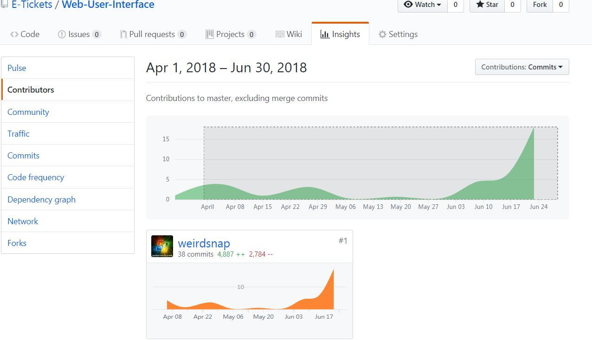

# 15331057_总结报告

## 课程学习自我总结

  首先感谢小组另外的两名成员，qubic的稳定后端，jason的精确UI设计,给了我很舒适的开发环境。

  作为前端开发的我，分析一个页面的架构，怕是最多的时候了。这里我就总结一些分析设计实现图片的时候的一些小问题吧。

  简单来说，设计图是静态图片，而前端页面是一个动态的实现，要收到用户的使用，后台数据不同情况下等等的影响，有些问题在静态图片里面不能容易发现。比如溢出问题，用户输入了很多文本之后的界面变化，较长的后端数据，不同于静态图片，要在实现静态设计稿的时候小心这些地方。

  再是，实现同一个样式，可能有很多的很多的思路，可能在实现的时候有时候你已经有了思维的套路，但是不一定这个套路就是最好的，也不一定就是适合的。有时候要能放下自己的思维定势，想一想，从需求和功能实现的角度，什么样的实现方法更合适。

## PSP2.1统计表
|PSP2.1||time(person hour)|
|:-:|:-:|:-:|
|**Planning**|**计划**|4|
|·Estimate|估计这个任务需要多少时间|4|
|**Development**|**开发**|75|
|·Analysis|需求分析 (包括学习新技术)|20|
|·Design Spec|生成设计文档|5|
|·Design Review|设计复审 (和同事审核设计文档)|1|
|·Coding Standard|代码规范 (为目前的开发制定合适的规范)|2|
|·Design|具体设计|10|
|·Coding|具体编码|30|
|·Code Review|代码复审|3|
|·Test|测试（自我测试，修改代码，提交修改）|3|
|**Report**|**报告**|5|
|·Test Report|测试报告|2|
|·Size Measurement| 计算工作量|1|
|·Postmortem & Process Improvement Plan|事后总结, 并提出过程改进计划|2|
## 个人分支git统计报告(截图)

## 自认为最得意/或有价值/或有苦劳的工作清单，含简短说明（一句话）

  

## 个人的技术类、项目管理类博客清单（只需要名称与 url ）