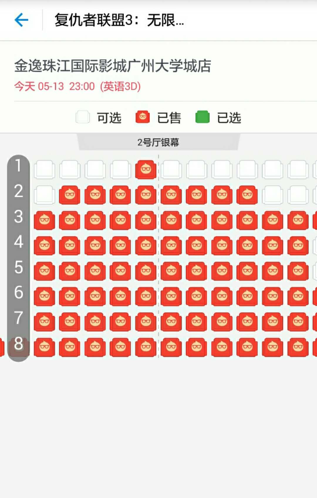

# 支付宝淘票票购票文档

## 1. 应用主界面

---

## 2. 选择一部电影

可以选择一部正在热映的影片，如复联，点击购票进入详情界面。可以选择区域、时段进行影院场次筛选：

---

## 3. 选择一家影院

选择影院进入影院排片详情界面：

---

## 4. 选择场次并选座

在上面的页面中，选择你想要的场次点击购票，进入选座页面：

---

## 5. 创建订单

根据影院、场次、座位创建订单：

---

## 6. 支付订单

支付刚才创建的订单

